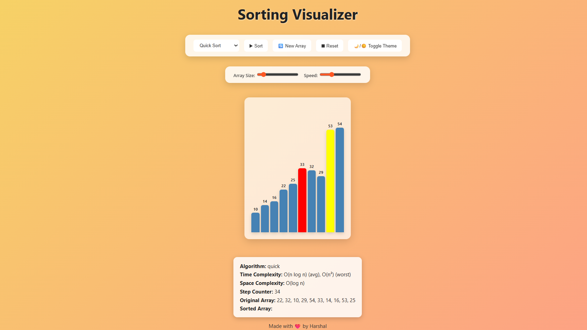
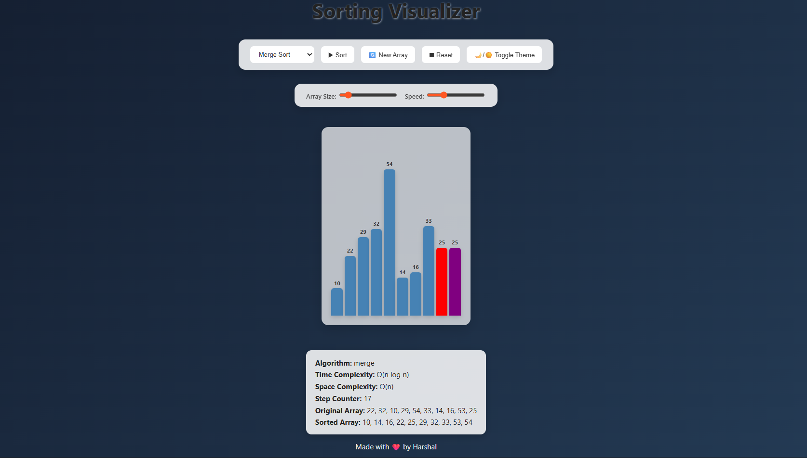

📖 About Project

The Sorting Visualizer is an interactive web-based application that helps users understand how different sorting algorithms work.
It visually demonstrates how elements in an array move step by step until the array becomes sorted.

I built the backend using Java + Spring Boot, where all sorting algorithms are implemented. The backend returns the sequence of steps, comparisons, and highlights (like pivot in Quick Sort or merged section in Merge Sort).

The frontend is built using HTML, CSS, and JavaScript, which takes these steps from the backend and animates them. Each element of the array is represented as a bar, and the bars change color to show:

🔴 Comparison

🟡 Pivot (Quick Sort)

🟣 Merge section (Merge Sort)

🟢 Sorted elements

This project not only explains sorting concepts visually but also helps in comparing the time and space complexity of different algorithms.

It is a perfect blend of algorithms, backend APIs, and frontend visualization, making it a great project for learning and demonstration.
🚀 Features

Visualizes 5 sorting algorithms:

Bubble Sort 🔵

Selection Sort 🟠

Insertion Sort 🟣

Merge Sort 🟡

Quick Sort 🟢

Color-coded highlights:

🔴 Red → comparing elements

🟡 Yellow → pivot (Quick Sort)

🟣 Purple → merged section (Merge Sort)

🟢 Green → sorted

Step counter (track how many operations were performed)

Time & Space Complexity displayed for each algorithm

Speed slider → control animation speed

Array size slider → generate small/large arrays

Light/Dark mode toggle 🌙☀️

Responsive UI with modern aesthetic look
🖥️ Tech Stack

Backend: Java 21, Spring Boot, Maven

Frontend: HTML, CSS (glassmorphism + pastel gradient UI), Vanilla JavaScript

Deployment: Render (backend) + Netlify (frontend)

Project Structure
sorting-visualizer/
│
├── backend/ (Spring Boot API)
│   ├── src/main/java/com/sortingvisualizer/
│   │   ├── controller/ (REST APIs)
│   │   ├── model/ (DTOs: SortStep, SortResponse)
│   │   └── service/ (Sorting logic)
│   └── resources/application.properties
│
├── frontend/ (Static Website)
│   ├── index.html
│   ├── style.css
│   └── script.js
│
└── README.md

👨‍💻 Author

Harshal Turankar
💼 MCA Student @ Ramdeobaba University, Nagpur
📧 [harshalt805@gmail.com]
🔗 [https://www.linkedin.com/in/harshal-turankar-b856941b4/]

SCREENSHOTS
(Light mode)

(Dark mode)
